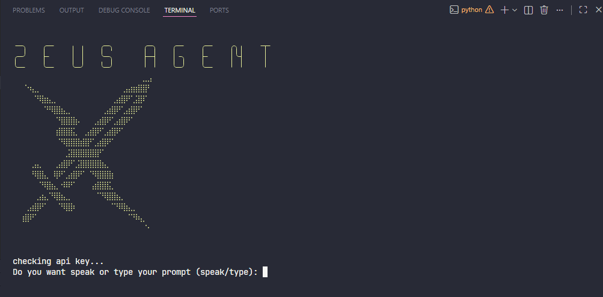

# ⚡ Zeus Agent

<div align="center">

[](https://github.com/Taha-Azadi/TD-Zeus-Agent)

<p>
  <a href="https://www.python.org/downloads/"></a>
  <a href="LICENSE"></a>
  <a href="#"></a>
  <a href="#"></a>
  <a href="#"></a>
  <a href="#"></a>
</p>



<p><b>🤖 A voice-enabled AI agent with autonomous tool-calling capabilities.</b></p>
<p><i>Talk to your computer. It listens, learns, and acts.</i></p>

<p>
  <a href="#-features">✨ Features</a> •
  <a href="#-demo">🎬 Demo</a> •
  <a href="#-installation">📦 Installation</a> •
  <a href="#-usage">🚀 Usage</a> •
  <a href="#-tools">🔧 Tools</a> •
  <a href="#-memory">🧠 Memory</a> •
  <a href="#-architecture">🏗️ Architecture</a> •
  <a href="#-tech-stack">🛠️ Tech Stack</a> •
  <a href="#-troubleshooting">🔍 Troubleshooting</a> •
  <a href="#-roadmap">🗺️ Roadmap</a>
</p>

</div>

---

## ✨ Features

<table>
<tr>
<td width="50%">

### 🎙️ Voice Interface
- **Hands-free control** using speech recognition
- **Real-time audio capture** with ambient noise filtering
- **Text-to-speech responses** with natural voice output
- **Wake phrase detection** — just say *"Hey Zeus"*

### 🤖 AI-Powered Conversations
- **Streaming responses** via OpenRouter API
- **Multi-model support** — NVIDIA Nemotron, GPT, Claude, and more
- **Reasoning display** — see the AI's thought process in real-time
- **Markdown rendering** with syntax highlighting

</td>
<td width="50%">

### 🔧 Autonomous Tool Calling
- **10 built-in tools** the AI can invoke on its own
- **File system operations** — read, write, list directories
- **System monitoring** — CPU, RAM, disk usage in real-time
- **Application control** — launch apps and websites by voice

### 🧠 Persistent Memory
- **Learns from every conversation**
- **Remembers user preferences** (name, habits, paths)
- **Context-aware responses** based on past interactions
- **JSON-based memory storage** — human-readable & editable

</td>
</tr>
</table>

### 🌐 Additional Capabilities
- **100+ websites** supported for instant navigation
- **Local music player** with fuzzy search across your library
- **Screenshot capture** with customizable save paths
- **Cross-platform** — Windows, macOS, Linux
- **Rich terminal UI** with animated spinners and panels

---

## 🎬 Demo

```bash
# Voice mode — just talk!
$ python main.py
> speak
🎤 Listening...
You: "Open YouTube and play my favorite song"
🔧 open_website({"site_name": "youtube"})
🔧 play_music({"name": "favorite"})
Zeus: ✅ Done! YouTube is open and I'm playing your music.

# Text mode — type commands
> type
You: create a docx file on desktop with B Nazanin font saying سلام خوبی
🔧 run_shell_command({"command": "python -c \"...\""})
Zeus: 📄 File saved to Desktop/greeting.docx with B Nazanin font!
```

---

## 📦 Installation

### Prerequisites

| Requirement | Version | Notes |
|-------------|---------|-------|
| Python | 3.9+ | Required |
| pip | Latest | Package manager |
| Microphone | Any | For voice mode |
| Internet | Stable | For AI API calls |

### 🚀 Quick Install (Recommended)

```bash
# Clone the repository
git clone https://github.com/Taha-Azadi/TD-Zeus-Agent.git
cd TD-Zeus-Agent

# Run the automated installer
python install.py
```

The installer will:
1. ✅ Check Python version
2. ✅ Install all dependencies from `requirements.txt`
3. ✅ Verify PortAudio (Linux)
4. ✅ Create configuration files
5. ✅ Run first-time setup wizard

### 🐧 Linux Pre-Setup

```bash
# Ubuntu/Debian
sudo apt install portaudio19-dev python3-pyaudio

# Fedora
sudo dnf install portaudio-devel python3-pyaudio

# Arch
sudo pacman -S portaudio python-pyaudio
```

### 📋 Manual Install

```bash
# Create virtual environment (recommended)
python -m venv venv
source venv/bin/activate  # Linux/macOS
venv\\Scripts\\activate  # Windows

# Install dependencies
pip install -r requirements.txt
```

### requirements.txt

```
requests>=2.31.0
speechrecognition>=3.10.0
pyaudio>=0.2.13
pyttsx3>=2.90
rich>=13.7.0
colorama>=0.4.6
pyautogui>=0.9.54
psutil>=5.9.8
pywin32>=306; platform_system=="Windows"
python-docx>=1.1.0
```

---

## 🚀 Usage

### First Run Setup

```bash
python main.py
```

```
╔═══════════════════════════════════════════════════════════════╗
║  ⚡ Zeus Agent v1.0.1                                         ║
║  First-time setup                                              ║
╠═══════════════════════════════════════════════════════════════╣
║  Enter your OpenRouter API key: [your-key-here]               ║
║  Enter your preferred name: Taha                              ║
╚═══════════════════════════════════════════════════════════════╝
✅ Setup complete! Config saved to ai.txt and ask2.txt
```

### Interaction Modes

| Mode | Command | Input | Output | Best For |
|------|---------|-------|--------|----------|
| 🎙️ **Speak** | `speak` | Microphone | Voice + Text | Hands-free tasks |
| ⌨️ **Type** | `type` | Keyboard | Text only | Complex commands |
| 🤖 **Auto** | `auto` | Both | Both | Mixed usage |

### Built-in Voice/Text Commands

| Phrase | Action | Tool Used |
|--------|--------|-----------|
| `"open youtube"` / `"open github"` | Launch website | `open_website` |
| `"play [song name]"` | Play local music | `play_music` |
| `"what time is it"` | Show current time | `get_current_time` |
| `"take a screenshot"` | Capture screen | `take_screenshot` |
| `"show system info"` | Display CPU/RAM/Disk | `get_system_info` |
| `"clear"` / `"cls"` | Clear terminal | — |
| `"hello"` / `"hi"` | Greeting response | — |
| `"hey Zeus"` | Wake phrase | — |
| `"bye"` / `"goodbye"` | Exit application | — |

### Example Conversations

#### 💼 Productivity
```
You: Create a Python script on my desktop that calculates factorial
🔧 write_file_content({"filepath": "~/Desktop/factorial.py", "content": "..."})
Zeus: ✅ Saved factorial.py to your Desktop!
```

#### 🎵 Entertainment
```
You: Play something by Taylor Swift
🔧 play_music({"name": "Taylor Swift"})
Zeus: 🎵 Playing: Taylor Swift - Love Story.mp3
```

#### 🖥️ System
```
You: What's my CPU and RAM usage?
🔧 get_system_info({})
Zeus: 📊 CPU: 23% | RAM: 45% (3.6GB / 8GB) | Disk: 67% (120GB / 180GB)
```

#### 📝 Document Creation
```
You: Make a Word document on desktop with B Nazanin font saying سلام خوبی
🔧 run_shell_command({"command": "python -c \"...\""})
Zeus: 📄 Created Desktop/greeting.docx with B Nazanin font!
```

---

## 🔧 Tools

Zeus can invoke these tools **autonomously** based on natural language requests:

### Core Tools

| Tool | Description | Parameters | Example |
|------|-------------|------------|---------|
| `run_shell_command` | Execute terminal commands | `command`, `cwd` (optional) | `"ls -la"`, `"python script.py"` |
| `list_directory` | Browse files with metadata | `path` (default: `.`) | `"C:/Users/PASARGAD/Desktop"` |
| `read_file_content` | Read text files (up to 8K chars) | `filepath`, `max_chars` | `"README.md"` |
| `write_file_content` | Create/overwrite text files | `filepath`, `content` | `"hello.txt"`, `"Hello!"` |
| `write_binary_file` | Create binary files (DOCX, images) | `filepath`, `content_bytes` | `"doc.docx"`, base64 |

### System Tools

| Tool | Description | Returns |
|------|-------------|---------|
| `get_system_info` | CPU, RAM, disk, OS details | Formatted system stats |
| `take_screenshot` | Capture and save screen | Save path |
| `get_current_time` | Current date and time | `YYYY-MM-DD HH:MM:SS` |

### Application Tools

| Tool | Description | Supports |
|------|-------------|----------|
| `open_application` | Launch apps by name | Windows: `start`, macOS: `open`, Linux: direct |
| `open_website` | Navigate to 100+ sites | YouTube, GitHub, Google, Netflix, etc. |
| `play_music` | Play local audio files | `.mp3`, `.wav`, `.m4a`, `.flac`, `.ogg` |

### Memory Tools 🧠

| Tool | Description | Use Case |
|------|-------------|----------|
| `save_memory` | Save info to long-term memory | User preferences, paths, habits |
| `load_memories` | Retrieve all saved memories | Context for responses |
| `search_memories` | Search memories by keyword | Find specific past info |

---

## 🧠 Memory System

Zeus **learns and remembers** from every conversation.

### How It Works

```
User: "My name is Taha and I use B Nazanin font for Persian docs"
        ↓
Zeus: 🔧 save_memory({"key": "user_name", "content": "User's name is Taha"})
      🔧 save_memory({"key": "font_preference", "content": "B Nazanin for Persian"})
        ↓
[Saved to zeus_memory.json]
```

### Memory File Structure

```json
[
  {
    "id": 1,
    "timestamp": "2026-07-29T12:30:00",
    "key": "user_name",
    "content": "User's name is Taha"
  },
  {
    "id": 2,
    "timestamp": "2026-07-29T12:35:00",
    "key": "desktop_path",
    "content": "C:/Users/PASARGAD/Desktop"
  }
]
```

### Auto-Learning Triggers

Zeus automatically saves memory for:
- ✅ User's name
- ✅ File paths (Desktop, Documents, etc.)
- ✅ Font preferences
- ✅ Favorite apps/websites
- ✅ Music preferences
- ✅ System configurations
- ✅ Successful command patterns

---

## 🏗️ Architecture

```
┌─────────────────────────────────────────────────────────────┐
│                      USER INPUT                              │
│              (Voice 🎙️  |  Text ⌨️  |  Auto 🤖)              │
└─────────────────────┬───────────────────────────────────────┘
                      │
                      ▼
┌─────────────────────────────────────────────────────────────┐
│              SPEECH RECOGNITION (SpeechRecognition)          │
│         ┌─────────────┐          ┌─────────────────┐         │
│         │  Google API │          │  Whisper (opt)  │         │
│         └─────────────┘          └─────────────────┘         │
└─────────────────────┬───────────────────────────────────────┘
                      │
                      ▼
┌─────────────────────────────────────────────────────────────┐
│              AI ENGINE (OpenRouter API)                        │
│         ┌─────────────────────────────────────┐               │
│         │  Models: Nemotron / GPT / Claude    │               │
│         │  Streaming: Real-time token output  │               │
│         │  Tool Choice: Auto-invocation       │               │
│         └─────────────────────────────────────┘               │
└─────────────────────┬───────────────────────────────────────┘
                      │
        ┌─────────────┼─────────────┐
        ▼             ▼             ▼
┌──────────┐  ┌──────────┐  ┌──────────────┐
│  TOOLS   │  │  MEMORY  │  │  TTS OUTPUT  │
│  Engine  │  │  System  │  │  (pyttsx3)   │
└──────────┘  └──────────┘  └──────────────┘
```

### Data Flow

1. **Input** → Voice captured via PyAudio → SpeechRecognition
2. **Processing** → Text sent to OpenRouter with tool schemas
3. **Reasoning** → AI decides: direct answer or tool call?
4. **Action** → Tool executes → Result returned to AI
5. **Memory** → Important facts auto-saved to `zeus_memory.json`
6. **Output** → Response streamed to terminal + spoken via TTS

---

## 🛠️ Tech Stack

<p align="center">
  
</p>

| Technology | Purpose | Version |
|------------|---------|---------|
| **Python** | Core runtime | 3.9+ |
| **OpenRouter API** | LLM integration (multi-model) | Latest |
| **SpeechRecognition** | Voice-to-text | 3.10+ |
| **PyAudio** | Audio stream capture | 0.2.13+ |
| **pyttsx3** | Text-to-speech | 2.90+ |
| **Rich** | Terminal UI (markdown, panels, spinners) | 13.7+ |
| **Colorama** | Cross-platform colored output | 0.4.6+ |
| **pyautogui** | Screenshot automation | 0.9.54+ |
| **psutil** | System metrics (CPU, RAM, disk) | 5.9.8+ |
| **python-docx** | Word document generation | 1.1+ |
| **pywin32** | Windows COM integration | 306+ |

---

## 📁 Project Structure

```
TD-Zeus-Agent/
│
├── 📄 main.py                          # Entry point with animated boot
├── 📄 install.py                       # Cross-platform installer
├── 📄 requirements.txt                 # Python dependencies
├── 📄 README.md                        # This file
├── 📄 LICENSE                          # MIT License
│
├── 🔑 ai.txt                       # API key storage
├── 👤 ask2.txt                     # User name
└── 🧠 zeus_memory.json            # Persistent memory
├── 📁 src/
│   ├── 🎙️ speak.py                     # Voice interaction handler
│   ├── ⌨️ type.py                      # Text interaction handler
│   ├── 🔧 utils.py                     # Tool implementations
│   ├── 🧠 memory.py                    # Memory system
│   ├── 🤖 ai_engine.py                 # OpenRouter streaming
│   └── 🎨 ui.py                        # Rich terminal components
│
├── 📁 docs/
│   ├── 📖 usage.md                     # Extended documentation
│
└── 📁 screenshots/
    ├── 🖼️ banner.png                   # App banner
```

---

## ⚙️ Configuration

| File | Purpose | Format |
|------|---------|--------|
| `ai.txt` | OpenRouter API key | Plain text, single line |
| `ask2.txt` | User's preferred name | Plain text |
| `zeus_memory.json` | Persistent conversation memory | JSON array |

### Environment Variables

```bash
export ZEUS_API_KEY="your-openrouter-key"      # Override ai.txt
export ZEUS_USER_NAME="Taha"                    # Override ask2.txt
export ZEUS_MODEL="nvidia/nemotron-3-ultra"   # Default AI model
export ZEUS_VOICE_SPEED="150"                  # TTS words per minute
export ZEUS_VOICE_ID="0"                       # pyttsx3 voice index
```

---

## 🔍 Troubleshooting

### Common Issues

| Issue | Cause | Solution |
|-------|-------|----------|
| `No module named 'docx'` | python-docx not installed | `pip install python-docx` |
| `PortAudio not found` | Missing system audio lib | `sudo apt install portaudio19-dev` |
| `API Key invalid (401)` | Wrong/expired key | Check `ai.txt` or set `ZEUS_API_KEY` |
| `Microphone not detected` | No input device | Check system sound settings |
| `TTS not working` | Missing voice packs | Install espeak (Linux): `sudo apt install espeak` |
| `list index out of range` | Empty API response | Fixed in v1.0.1 — update! |
| `File not found` | Wrong path format | Use forward slashes: `C:/Users/...` |
| `Persian text garbled` | Encoding issue | Ensure UTF-8 in terminal |

### Debug Mode

```bash
# Enable verbose logging
python main.py --debug

# Test tools individually
python -c "from src.utils import *; print(get_system_info())"

# Check memory
python -c "from src.memory import load_memories; print(load_memories())"
```

### Getting Help

1. 📖 Check [docs/troubleshooting.md](docs/troubleshooting.md)
2. 🔍 Search [existing issues](https://github.com/Taha-Azadi/TD-Zeus-Agent/issues)
3. 💬 Open a [new issue](https://github.com/Taha-Azadi/TD-Zeus-Agent/issues/new)

---

## 🗺️ Roadmap

### v1.0.2 (Coming Soon)
- [ ] 🌐 Multi-language support (Persian, Arabic, French)
- [ ] 🔌 Plugin system for custom tools
- [ ] 📧 Email integration (read/send)
- [ ] 🗓️ Calendar and reminder system

### v1.0.3 (Planned)
- [ ] 🖼️ Image generation via DALL-E/Stable Diffusion
- [ ] 📊 Data visualization (charts, graphs)
- [ ] 🔗 Web scraping and data extraction
- [ ] 🤝 Multi-user support

### v1.0.4 (Future)
- [ ] 🧠 Local LLM support (Llama, Mistral)
- [ ] 📱 Mobile companion app
- [ ] ☁️ Cloud sync for memories
- [ ] 🔒 End-to-end encrypted memory

---

## 🤝 Contributing

We love contributions! Here's how:

```bash
# 1. Fork the repo
# 2. Clone your fork
git clone https://github.com/YOUR-USERNAME/TD-Zeus-Agent.git

# 3. Create a branch
git checkout -b feature/amazing-feature

# 4. Make changes & commit
git commit -m "✨ Add amazing feature"

# 5. Push & open PR
git push origin feature/amazing-feature
```

### Contribution Guidelines

- 📝 Follow PEP 8 style guide
- 🧪 Add tests for new tools
- 📖 Update README for new features
- 🏷️ Use conventional commits (`feat:`, `fix:`, `docs:`)

---

## 📊 Stats

<p align="center">
  
  
  
  
</p>

---

## 📜 License

```
MIT License

Copyright (c) 2026 Taha Azadi

Permission is hereby granted, free of charge, to any person obtaining a copy
of this software and associated documentation files (the "Software"), to deal
in the Software without restriction, including without limitation the rights
to use, copy, modify, merge, publish, distribute, sublicense, and/or sell
copies of the Software, and to permit persons to whom the Software is
furnished to do so, subject to the following conditions:

The above copyright notice and this permission notice shall be included in all
copies or substantial portions of the Software.

THE SOFTWARE IS PROVIDED "AS IS", WITHOUT WARRANTY OF ANY KIND...
```

Full text: [LICENSE](LICENSE)

---

## 🙏 Acknowledgments

- 🤖 [OpenRouter](https://openrouter.ai/) for AI model access
- 🎨 [Rich](https://github.com/Textualize/rich) for beautiful terminal UI
- 🗣️ [SpeechRecognition](https://github.com/Uberi/speech_recognition) for voice input
- 🌍 The open-source community

---

<div align="center">

## ⚡ Built with passion by [Taha Azadi](https://github.com/Taha-Azadi)

<p>
  <a href="https://github.com/Taha-Azadi"></a>
  <a href="https://x.com/TahaAzadiDev"></a>
  <a href="https://www.linkedin.com/in/Taha-Azadi-Dev"></a>
  <a href="mailto:taha.azadi.dev@gmail.com"></a>
  <a href="https://t.me/TahaAzadiDev"></a>
</p>

⭐ **Star this repo if you find it useful!** ⭐

</div>
